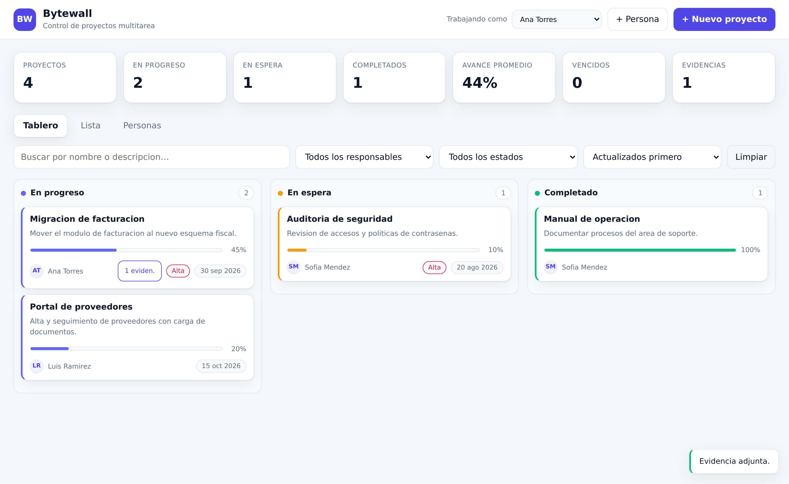

# Bytewall · Control de proyectos multitarea

Aplicación web para dar seguimiento a varios proyectos al mismo tiempo: alta de
proyectos, estado, responsable, porcentaje de avance y **evidencias adjuntas**
(PDF, Excel, XML, Word, JPG, PNG) que la persona asignada puede subir junto con
una nota de avance.



## Qué incluye

| Requerimiento | Dónde está |
|---|---|
| Agregar proyecto (nombre y descripción) | Botón **+ Nuevo proyecto** |
| Estado: *in progress · hold · complete* | Selector en el alta, en la lista, en el detalle y arrastrando tarjetas entre columnas del tablero |
| Asignar a una persona | Campo **Responsable** (personas se dan de alta con **+ Persona**) |
| Ver estado de avance | Barra de % en tarjeta, lista y detalle + KPIs y avance promedio por persona |
| Adjuntar evidencia (pdf, xlsx/xls, xml, docx/doc, jpg, jpeg, png) | Panel **Evidencias de avance** dentro del detalle del proyecto |
| Editar estatus del proyecto | Detalle (formulario completo), lista (selector en línea) y tablero (arrastrar y soltar) |

Extras que se agregaron porque el flujo los pedía: prioridad, fecha compromiso,
indicador de proyectos vencidos, buscador y filtros, bitácora de movimientos por
proyecto (quién cambió qué y cuándo) y vista de carga de trabajo por persona.

## Requisitos

- Node.js 18 o superior (probado en Node 22).

## Instalación y arranque

```bash
npm install
npm run seed     # opcional: 3 personas y 4 proyectos de ejemplo
npm start        # http://localhost:3000
```

Para desarrollo con recarga automática: `npm run dev`.
Pruebas de la API: `npm test`.

### Variables de entorno

| Variable | Valor por defecto | Descripción |
|---|---|---|
| `PORT` | `3000` | Puerto del servidor |
| `HOST` | `0.0.0.0` | Interfaz de escucha |
| `DATA_DIR` | `./data` | Carpeta de datos |
| `DB_FILE` | `./data/bytewall.db` | Archivo SQLite |
| `UPLOAD_DIR` | `./data/uploads` | Carpeta de evidencias |
| `MAX_UPLOAD_MB` | `25` | Tamaño máximo por archivo |

La carpeta `data/` está en `.gitignore`: la base y los archivos subidos no se
versionan. Para respaldar, copie esa carpeta completa.

## Cómo se usa

1. **Agregue las personas** del equipo con **+ Persona**.
2. Cada quien elige su nombre en **“Trabajando como”** (arriba a la derecha).
   Eso sirve para firmar las evidencias y los movimientos de la bitácora; queda
   guardado en el navegador.
3. **Cree proyectos** con **+ Nuevo proyecto**: nombre, descripción, estado,
   responsable, prioridad, fecha compromiso y avance inicial.
4. **Actualice el estado** de tres formas: arrastrando la tarjeta a otra columna
   del tablero, con el selector de la vista **Lista**, o desde el detalle.
   Al marcar un proyecto como *Completado* el avance pasa automáticamente a 100 %.
5. **Suba evidencia**: abra el proyecto, elija el archivo, escriba una nota y
   mueva la barra de avance. El archivo queda ligado al proyecto, con quién lo
   subió y cuándo; se puede ver en línea o descargar.

## Arquitectura

```
server.js              arranque del servidor
src/app.js             app de Express, rutas y manejo de errores
src/db.js              conexión SQLite + bitácora
src/schema.sql         tablas: people, projects, attachments, activity
src/constants.js       estados, prioridades, formatos permitidos
src/validation.js      validación de entrada
src/storage.js         multer, nombres de archivo y borrado seguro
src/routes/            people.js · projects.js · attachments.js
public/                interfaz (HTML + CSS + JS sin dependencias)
test/api.test.js       pruebas de la API con node:test
```

Sin build ni framework de frontend: se sirve HTML, CSS y JS estáticos.

### API

| Método | Ruta | Descripción |
|---|---|---|
| `GET` | `/api/config` | Estados, prioridades, formatos y tamaño máximo |
| `GET/POST` | `/api/people` | Listar (con carga de trabajo) y crear personas |
| `PATCH/DELETE` | `/api/people/:id` | Editar o eliminar (sus proyectos quedan sin responsable) |
| `GET` | `/api/projects?status=&assignee_id=&q=&sort=` | Listar con filtros |
| `GET` | `/api/projects/stats` | Indicadores del tablero |
| `POST` | `/api/projects` | Crear proyecto |
| `GET` | `/api/projects/:id` | Detalle con evidencias y bitácora |
| `PATCH` | `/api/projects/:id` | Actualización parcial (estado, avance, responsable…) |
| `DELETE` | `/api/projects/:id` | Eliminar proyecto y sus evidencias |
| `GET/POST` | `/api/projects/:id/attachments` | Listar y subir evidencia (`multipart/form-data`) |
| `GET` | `/api/attachments/:id/file` | Descargar (`?inline=1` para ver en el navegador) |
| `DELETE` | `/api/attachments/:id` | Eliminar evidencia |

## Notas de seguridad

- Los nombres de archivo en disco los genera el servidor (UUID + extensión
  validada); el nombre original solo se guarda en la base de datos, así que la
  entrada del usuario nunca toca rutas del sistema de archivos.
- Solo se aceptan las extensiones de la lista blanca y hay límite de tamaño.
- Toda consulta usa sentencias preparadas.
- El contenido dinámico se escapa antes de insertarse en el DOM.

**No hay autenticación.** El selector “Trabajando como” sirve para atribuir
evidencias y movimientos, no para controlar acceso. Si la herramienta va a salir
de una red interna de confianza, hay que ponerle inicio de sesión (o dejarla
detrás de un proxy que lo haga) antes de publicarla.
