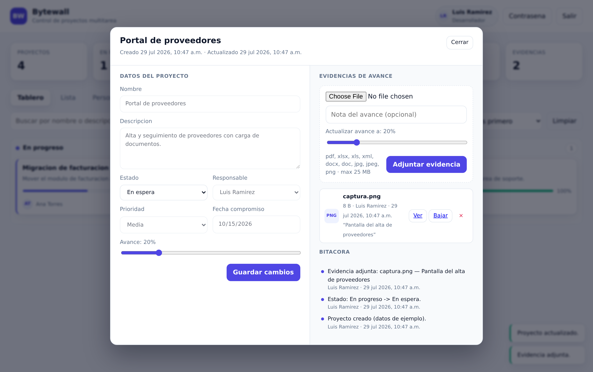

# Bytewall · Control de proyectos multitarea

Aplicación web para dar seguimiento a varios proyectos al mismo tiempo: alta de
proyectos, estado, responsable, porcentaje de avance y **evidencias adjuntas**
(PDF, Excel, XML, Word, JPG, PNG) que la persona asignada puede subir junto con
una nota de avance.


Cada persona entra con su cuenta; el detalle del proyecto concentra el avance,
las evidencias y la bitácora.



## Qué incluye

| Requerimiento | Dónde está |
|---|---|
| Agregar proyecto (nombre y descripción) | Botón **+ Nuevo proyecto** |
| Estado: *in progress · hold · complete* | Selector en el alta, en la lista, en el detalle y arrastrando tarjetas entre columnas del tablero |
| Asignar a una persona | Campo **Responsable** (personas se dan de alta con **+ Persona**) |
| Ver estado de avance | Barra de % en tarjeta, lista y detalle + KPIs y avance promedio por persona |
| Adjuntar evidencia (pdf, xlsx/xls, xml, docx/doc, jpg, jpeg, png) | Panel **Evidencias de avance** dentro del detalle del proyecto |
| Editar estatus del proyecto | Detalle (formulario completo), lista (selector en línea) y tablero (arrastrar y soltar) |

Extras que se agregaron porque el flujo los pedía: inicio de sesión con dos
roles, prioridad, fecha compromiso, indicador de proyectos vencidos, buscador y
filtros, bitácora de movimientos por proyecto (quién cambió qué y cuándo) y
vista de carga de trabajo por persona.

## Requisitos

- Node.js 18 o superior (probado en Node 22).

## Instalación y arranque

```bash
npm install
npm start        # http://localhost:3000
```

En el primer arranque, si no hay ninguna cuenta con acceso, se crea un
administrador y **la contraseña se imprime una sola vez en la consola**:

```
=== Usuario administrador inicial ===
  Correo:     admin@bytewall.local
  Contrasena: xY7kQ2mNp4Rt
```

Para fijar esas credenciales en lugar de que se generen:

```bash
ADMIN_EMAIL=jefe@empresa.com ADMIN_PASSWORD='una-clave-larga' npm start
```

Con `npm run seed` se cargan 3 personas y 4 proyectos de ejemplo; el script
imprime los correos y la contraseña de prueba (`bytewall2026` por defecto).
Es solo para probar: no lo use en producción.

Para desarrollo con recarga automática: `npm run dev`.
Pruebas de la API y de permisos: `npm test`.

### Variables de entorno

| Variable | Valor por defecto | Descripción |
|---|---|---|
| `PORT` | `3000` | Puerto del servidor |
| `HOST` | `0.0.0.0` | Interfaz de escucha |
| `DATA_DIR` | `./data` | Carpeta de datos |
| `DB_FILE` | `./data/bytewall.db` | Archivo SQLite |
| `UPLOAD_DIR` | `./data/uploads` | Carpeta de evidencias |
| `MAX_UPLOAD_MB` | `25` | Tamaño máximo por archivo |
| `ADMIN_EMAIL` / `ADMIN_PASSWORD` | generados | Credenciales del administrador inicial |
| `SESSION_DAYS` | `7` | Duración de la sesión |
| `COOKIE_SECURE` | `0` | Póngalo en `1` cuando sirva por HTTPS |
| `TRUST_PROXY` | `0` | `1` si corre detrás de un proxy inverso |
| `LOGIN_MAX_ATTEMPTS` | `8` | Intentos fallidos permitidos por 10 minutos |

## Acceso y roles

Todo pasa por inicio de sesión: sin cookie válida, la interfaz redirige a
`/login.html` y la API responde `401`. El correo es el usuario.

| | Administrador | Miembro |
|---|---|---|
| Ver todos los proyectos y el directorio | sí | sí |
| Crear, renombrar, reasignar y eliminar proyectos | sí | no |
| Cambiar estado y avance | de cualquier proyecto | solo donde es responsable |
| Adjuntar y borrar evidencias | de cualquier proyecto | solo donde es responsable |
| Dar de alta personas y contraseñas | sí | no |

Los administradores crean las cuentas desde **+ Persona**. Si deja la contraseña
vacía, la persona existe solo para aparecer como responsable y no puede entrar.
Cada quien cambia su propia clave con el botón **Contraseña**, lo que cierra sus
sesiones en otros dispositivos.

Estas reglas viven en `src/policy.js`. Si prefiere que cualquier miembro reporte
avance en cualquier proyecto, `canReportOnProject` es la única función a tocar.

La carpeta `data/` está en `.gitignore`: la base y los archivos subidos no se
versionan. Para respaldar, copie esa carpeta completa.

## Cómo se usa

1. **Entre como administrador** con las credenciales del primer arranque y
   cambie la contraseña desde el botón **Contraseña**.
2. **Agregue las personas** del equipo con **+ Persona**, con su correo,
   contraseña inicial y nivel de acceso. El autor de cada evidencia y de cada
   movimiento de la bitácora se toma de la sesión, no de un selector.
3. **Cree proyectos** con **+ Nuevo proyecto**: nombre, descripción, estado,
   responsable, prioridad, fecha compromiso y avance inicial.
4. **Actualice el estado** de tres formas: arrastrando la tarjeta a otra columna
   del tablero, con el selector de la vista **Lista**, o desde el detalle.
   Al marcar un proyecto como *Completado* el avance pasa automáticamente a 100 %.
5. **Suba evidencia**: abra el proyecto, elija el archivo, escriba una nota y
   mueva la barra de avance. El archivo queda ligado al proyecto, con quién lo
   subió y cuándo; se puede ver en línea o descargar.

## Arquitectura

```
server.js              arranque del servidor
src/app.js             app de Express, rutas y manejo de errores
src/auth.js            contraseñas (scrypt), sesiones, cookies y middleware
src/policy.js          quién puede hacer qué
src/db.js              conexión SQLite + bitácora
src/schema.sql         tablas: people, projects, attachments, activity, sessions
src/constants.js       estados, prioridades, formatos permitidos
src/validation.js      validación de entrada
src/storage.js         multer, nombres de archivo y borrado seguro
src/routes/            auth.js · people.js · projects.js · attachments.js
public/                interfaz y pantalla de acceso (HTML + CSS + JS sin dependencias)
test/api.test.js       pruebas de API, sesión y permisos con node:test
```

Sin build ni framework de frontend: se sirve HTML, CSS y JS estáticos.

### API

Salvo `/api/auth/login`, todas las rutas exigen sesión.

| Método | Ruta | Permiso | Descripción |
|---|---|---|---|
| `POST` | `/api/auth/login` | público | Inicia sesión y entrega la cookie |
| `POST` | `/api/auth/logout` | sesión | Cierra la sesión actual |
| `GET` | `/api/auth/me` | sesión | Usuario y nivel de acceso |
| `POST` | `/api/auth/password` | sesión | Cambia la contraseña propia |
| `GET` | `/api/config` | sesión | Estados, prioridades, formatos y tamaño máximo |
| `GET` | `/api/people` | sesión | Directorio con carga de trabajo |
| `POST` | `/api/people` | admin | Crear persona (con o sin acceso) |
| `PATCH/DELETE` | `/api/people/:id` | admin | Editar, reiniciar contraseña o eliminar |
| `GET` | `/api/projects?status=&assignee_id=&q=&sort=` | sesión | Listar con filtros |
| `GET` | `/api/projects/stats` | sesión | Indicadores del tablero |
| `POST` | `/api/projects` | admin | Crear proyecto |
| `GET` | `/api/projects/:id` | sesión | Detalle con evidencias y bitácora |
| `PATCH` | `/api/projects/:id` | responsable (estado y avance) / admin (todo) | Actualización parcial |
| `DELETE` | `/api/projects/:id` | admin | Eliminar proyecto y sus evidencias |
| `GET` | `/api/projects/:id/attachments` | sesión | Listar evidencias |
| `POST` | `/api/projects/:id/attachments` | responsable o admin | Subir evidencia (`multipart/form-data`) |
| `GET` | `/api/attachments/:id/file` | sesión | Descargar (`?inline=1` para ver en el navegador) |
| `DELETE` | `/api/attachments/:id` | responsable o admin | Eliminar evidencia |

## Notas de seguridad

- Las contraseñas se guardan con **scrypt** (sal aleatoria por usuario) y se
  comparan en tiempo constante. Mínimo 8 caracteres.
- La sesión vive en una cookie **HttpOnly, SameSite=Lax**; en la base solo se
  guarda el hash SHA-256 del token, nunca el token. Dar de baja a alguien,
  cambiar su contraseña o cerrar sesión invalidan los tokens al instante.
- El login responde lo mismo exista o no la cuenta, y se bloquea tras varios
  intentos fallidos seguidos.
- Las peticiones que cambian datos se rechazan si declaran otro origen (CSRF).
- El servidor decide **quién** hace cada cosa: el cliente ya no manda quién es,
  el autor de cada evidencia y movimiento sale de la sesión.
- Los nombres de archivo en disco los genera el servidor (UUID + extensión
  validada); el nombre original solo se guarda en la base de datos, así que la
  entrada del usuario nunca toca rutas del sistema de archivos.
- Solo se aceptan las extensiones de la lista blanca y hay límite de tamaño.
  Las evidencias se sirven con `nosniff` y CSP `sandbox`, y solo con sesión.
- Toda consulta usa sentencias preparadas.
- El contenido dinámico se escapa antes de insertarse en el DOM.

### Antes de publicarla fuera de la red interna

1. **Sírvala por HTTPS** y arranque con `COOKIE_SECURE=1` (y `TRUST_PROXY=1` si
   hay un proxy inverso delante). Sin esto la cookie de sesión viaja en claro.
2. Cambie la contraseña del administrador inicial y no use `npm run seed`.
3. Respalde la carpeta `data/`: ahí están la base y las evidencias.
